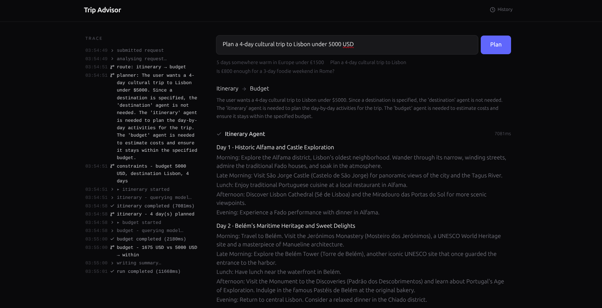

# Trip Advisor - multi-agent trip planner

A web app where a user describes a trip in plain language and a multi-agent
system plans it. An **orchestration layer** routes the request to three
specialised agents, chains them when they depend on each other
(**Destination → Itinerary → Budget**), and synthesises a single coherent
answer. Every step is streamed live and persisted as an audit trail.



## Demo

- Live app: **https://trip-advisor.akash11.com/**
- API health check: **https://trip-advisor-api.app3.in/api/health** (returns `{"ok":true}`)

## Tech stack

- **Frontend:** React 18 + TypeScript + Vite + Tailwind CSS v4, state via Context + `useReducer`.
- **Backend:** Node.js + Express 5, SSE streaming, PostgreSQL (`pg`) — works with any Postgres, including Supabase.
- **Shared:** an `@trip/shared` workspace package - zod schemas + types + the SSE event contract, one source of truth for both sides.
- **LLM:** a pluggable provider. Use Google Gemini, or any OpenAI-compatible endpoint (OpenAI, xAI Grok, Groq, Ollama, LM Studio). Switch with one env var.

## Project structure

```
trip-advisor/
├── shared/    @trip/shared - zod schemas, shared types, SSE event contract
├── backend/   Express API (Node + TypeScript)
│   └── src/
│       ├── llm/           provider interface + Gemini and OpenAI-compatible implementations
│       ├── db/            RunRepository interface + SQLite implementation
│       ├── agents/        destination, itinerary, budget (hard rules enforced in code)
│       ├── orchestrator/  planner, executor, synthesis
│       ├── routes/        POST /api/plan (SSE), GET /api/runs (history)
│       ├── config.ts      environment config
│       └── sse.ts         SSE channel helper
└── client/    React app (Vite)
    └── src/
        ├── components/    input, event trace, agent cards, budget table, history
        ├── state/         reducer + context (one shape, fed by the live stream or a stored run)
        ├── hooks/         useRunStream (SSE), useHistory
        └── lib/           SSE parser, config
```

## How to setup project locally

Prerequisites: **Node 20+** and **npm 10+** (check with `node -v` and `npm -v`).

**1. Clone the repo**

```bash
git clone https://github.com/akashvaghela09/trip-advisor.git && cd trip-advisor
```

**2. Install dependencies**

One install at the root covers all three workspaces (shared, backend, client):

```bash
npm install
```

> The backend needs a PostgreSQL database. The fastest option is a free
> [Supabase](https://supabase.com) project. copy its connection string into
> `DATABASE_URL` (see below).

**3. Configure the backend**

Copy the example env file, then edit `backend/.env`:

```bash
cp backend/.env.example backend/.env
```

- **Gemini (default):** set `LLM_PROVIDER=gemini` and `GEMINI_API_KEY=...` (free key: https://aistudio.google.com/apikey).
- **OpenAI-compatible** (OpenAI / Grok / Groq / Ollama / LM Studio): set `LLM_PROVIDER=openai`, `OPENAI_API_KEY`, `OPENAI_BASE_URL`, and `OPENAI_MODEL`. See the Environment variables table below.

The client has its own optional config (only needed to point at a remote API; not required for local dev):

```bash
cp client/.env.example client/.env
```

**4. Run everything**

One command starts shared (watch mode), the backend, and the client together:

```bash
npm run dev
```

- Client: http://localhost:5173
- API: http://localhost:3001 (the Vite dev server proxies `/api` to it, so there is no CORS in dev)

**5. Verify**

Open http://localhost:3001/api/health - it should return `{"ok":true}`. Then open the client at http://localhost:5173 and submit a trip request.

> Without a model key the app still runs and shows the error / degradation path: agents fail gracefully and the run is still recorded in the audit log.

### Production build

```bash
npm run build      # builds shared, compiles backend (tsc), builds client (vite)
npm start          # runs the compiled backend (node backend/dist/index.js)
```

## Environment variables

| Var                  | Where   | Purpose                                                                |
| -------------------- | ------- | ---------------------------------------------------------------------- |
| `LLM_PROVIDER`       | backend | `gemini` or `openai` (default `gemini`)                                |
| `GEMINI_API_KEY`     | backend | Gemini key (used when `LLM_PROVIDER=gemini`)                           |
| `GEMINI_MODEL`       | backend | Gemini model id (default `gemini-2.0-flash`)                           |
| `OPENAI_API_KEY`     | backend | Key for the OpenAI-compatible provider                                 |
| `OPENAI_BASE_URL`    | backend | Endpoint base URL (empty = OpenAI; set for Grok/Groq/Ollama/LM Studio) |
| `OPENAI_MODEL`       | backend | Model id (default `gpt-4o-mini`)                                       |
| `OPENAI_JSON_FORMAT` | backend | `json_object` / `json_schema` / `off`                                  |
| `PORT`               | backend | API port (default 3001)                                                |
| `ALLOWED_ORIGINS`    | backend | Comma-separated frontend origins allowed by CORS                       |
| `DATABASE_URL`       | backend | Postgres connection string (Supabase or self-hosted). |
| `LLM_TIMEOUT_MS`     | backend | Per-call timeout (default 25000; raise for local models)               |
| `LLM_MAX_RETRIES`    | backend | Retries per model call (default 2)                                     |
| `RUN_MAX_MS`         | backend | Overall run cap (default 90000)                                        |
| `VITE_API_URL`       | client  | Backend base URL in prod (empty in dev uses the Vite proxy)            |

## Persistence / audit schema

- `runs` - one row per request: message, plan, final answer, status, duration.
- `agent_steps` - one row per agent invocation: input, output, status, error,
  duration, constraint flag. This is the audit trail of which agents handled
  each request. Accessed behind a `RunRepository` interface, so the storage
  engine is a one-file swap (`backend/src/db/postgres.ts`).

## Notes

- [`docs/decision-note.md`](docs/decision-note.md) - the three biggest design decisions and what was cut.
- [`docs/architecture-azure.md`](docs/architecture-azure.md) - how this would deploy and scale on Azure.
